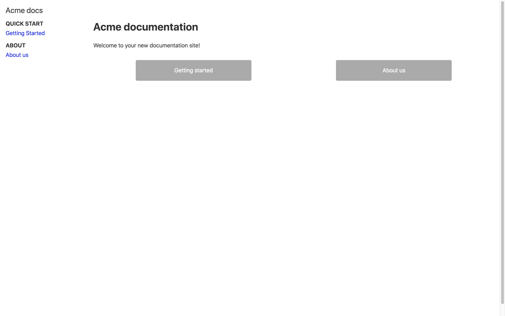

# Docs-as-code Starter Kit

You can use this repository as a starting point to manage your documentation as code.

This docs-as-code example is built on top of [Gatsby.js](https://www.gatsbyjs.org) and is part of a tutorial posted on Medium:

  * [How we switched to documentation-as-code with Gatsby.js and Netlify — part 1/2](https://medium.com/squadlytics/how-we-switched-to-documentation-as-code-with-gatsby-js-and-netlify-part-1-2-1f57ad732a05) 

## Getting started

Run the following commands in your CLI to serve your website locally.

```bash
git clone git@github.com:squadlytics/docs-as-code-starterkit.git
cd docs-as-code-starterkit
npm install
gatsby develop
```

You should be able to go to http://localhost:8000/ and see the docs homepage.



## Editing the docs

All the docs are written in Markdown in /src/docs. You can edit the existing pages or create new one with the following process:

  1. Create a new Markdown file in /src/docs/, for instance /src/docs/mydoc.md.
  2. Add a [Front Matter](https://jekyllrb.com/docs/frontmatter/) at the top of your doc.
  3. Make sure that the Front Matter contains the _path_ and _title_ of your doc. The path is how people will get access to the page.
  4. Write your doc in Markdown format and save it.
  5. Go to http://localhost:8000/<path_of_the_doc> to view it in your browser.

## Deploying

You can easily deploy your docs for free with [Netlify](https://netlify.com). Check out [the tutorial](https://medium.com/squadlytics/how-we-switched-to-documentation-as-code-with-gatsby-js-and-netlify-part-1-2-1f57ad732a05) if you want a step by step guide.

## Contributing

Please feel free to submit contribution to this repository by forking it and submitting a pull request.

